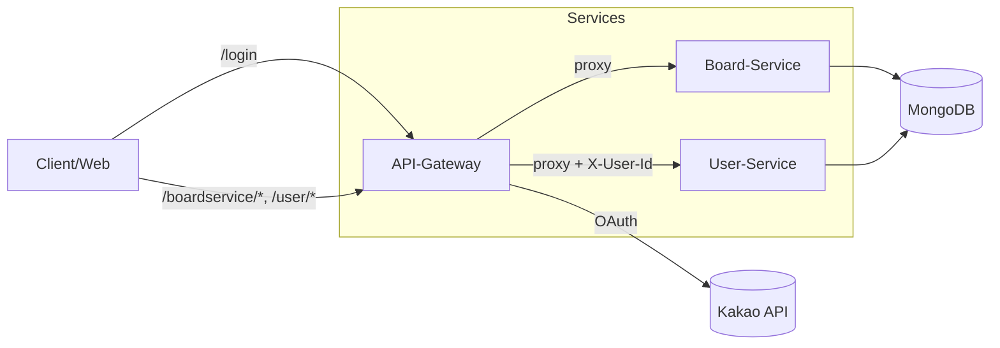

## KingWangJjang BE — 마이크로서비스 기반 커뮤니티 백엔드

FastAPI 기반의 API 게이트웨이와 도메인별 마이크로서비스(게시판, 사용자, GPT, 알림)로 구성된 백엔드 프로젝트입니다. GraphQL, JWT 인증, 카카오 OAuth, MongoDB, Docker 배포를 통합해 실서비스 수준의 구조를 구현했습니다.

### 왜 이 프로젝트인가
- **확장성**: API Gateway + 서비스 분리로 기능 확장/배포 독립성 확보
- **현실적인 인증/보안**: 카카오 OAuth → JWT 발급/갱신, 쿠키 기반 인증 흐름
- **데이터/쿼리 최적**: `Strawberry GraphQL` 기반 스키마/리졸버 모듈화
- **실전 운영 고려**: Docker Compose, 외부 네트워크, 로깅/환경 분리

### 핵심 기여 및 임팩트 (본인 역할)
- **시스템 설계**: API Gateway + 마이크로서비스 분리, 경로 기반 프록시 설계 및 공통 CORS/미들웨어 구성
- **인증/보안**: 카카오 OAuth 연동, JWT 발급/검증/재발급 플로우 구현, Gateway에서 `X-User-Id` 헤더 주입으로 다운스트림 인증 간소화
- **데이터 계층**: MongoDB 컬렉션 설계, 사용자/토큰 저장 로직, 안전한 커넥션 구성
- **GraphQL 도입**: Strawberry 스키마/리졸버로 서비스 간 계약 명확화 및 타입 안전성 강화
- **배포/운영**: Docker Compose 구성, 외부 네트워크 설계, 로그 볼륨/환경 분리 전략 수립
- **개발 생산성**: `.env.example` 표준화, 실행 문서화, 로컬/컨테이너 개발 흐름 일원화

---

### 아키텍처 개요


- `API-Gateway`(FastAPI): 경로 기반 프록시, 카카오 로그인, JWT 발급·검증, `X-User-Id` 헤더 주입
- `Board-Service`(FastAPI + Strawberry): 게시판 GraphQL API, 샘플 스키마, 유틸리티/크롤링/LLM 확장 포인트
- `User-Service`(FastAPI + Strawberry): 사용자 GraphQL API
- `MongoDB`: 공용 데이터 저장소 (유저/게시판 등)

---

### 기술 스택
- **언어/런타임**: Python 3.12
- **웹 프레임워크**: FastAPI, Strawberry GraphQL
- **데이터베이스**: MongoDB (`pymongo`)
- **인증**: Kakao OAuth → JWT(`pyjwt`) 발급/갱신
- **네트워킹**: HTTPX 프록시, CORS 설정, Docker Compose
- **런/패키징**: Poetry, Uvicorn
- (선택) LLM/크롤링 확장: LangChain, Ollama, Selenium 등 (`board-service` 의존성에 포함)

---

### 디렉터리 구조 (요약)
- `api-gateway/`: 인증, 프록시, 공통 엔트리
  - `app/main.py`: FastAPI 앱, CORS, 라우터 등록
  - `app/routes/index.py`: 경로 기반 프록시(`/boardservice/*`, `/user/*`)
  - `app/routes/auth/auth_controllers.py`: `/login`, `/callback` (카카오 OAuth)
- `board-service/`: 게시판 GraphQL, 도메인 서비스, 유틸
  - `app/main.py`: GraphQL 라우터(`/graphql`, `/sample`)
- `user-service/`: 사용자 GraphQL
  - `app/main.py`: GraphQL 라우터(`/graphql`)
- `gpt-service/`, `notification-service/`: 서비스 스켈레톤(확장 포인트)
- `docker-compose.yml`: 이미지 기반 다중 서비스 기동 설정

---

### 실행 방법

#### 1) Docker Compose (추천, 가장 빠름)
사전 준비: Docker, Docker Compose 설치

1) 외부 네트워크 생성 (compose는 `kingwangjjang-network`를 external로 사용)
```bash
docker network create kingwangjjang-network
```

2) 환경 변수 파일 준비 (레포 루트)
```bash
cp .env.example .env
# 필요한 값 채우기 (민감정보는 절대 커밋 금지)
```

3) 서비스 기동
```bash
docker compose up -d
```

기본 포트
- API-Gateway: `http://localhost:8000`
- Board-Service (내부 통신 33333), User-Service (내부 통신 33334)

요청 경로 예시 (게이트웨이 경유)
- 게시판: `http://localhost:8000/boardservice/graphql`
- 사용자: `http://localhost:8000/user/graphql`
- 로그인: `http://localhost:8000/login` → 카카오 동의 후 `REDIRECT_URI`로 콜백

#### 2) 로컬 개발 (Poetry)
사전 준비: Python 3.12, Poetry

1) 각 서비스 환경 변수 파일 생성
```bash
cp .env.example .env
```

2) 서비스별 의존성 설치
```bash
cd api-gateway && poetry install && cd -
cd board-service && poetry install && cd -
cd user-service && poetry install && cd -
```

3) 서비스 기동 (별도 터미널 3개)
```bash
# Board-Service (33333)
cd board-service && poetry run python app/main.py

# User-Service (33334)
cd user-service && poetry run python app/main.py

# API-Gateway (8000)
cd api-gateway && poetry run uvicorn app.main:app --reload --port 8000
```

Gateway는 경로 프리픽스에 따라 대상 서비스로 프록시합니다.
- `boardservice/` → Board-Service
- `user/` → User-Service (쿠키의 `access_token`을 검증하고 `X-User-Id` 헤더를 추가 전달)

---

### 환경 변수 (.env)
아래 키는 예시입니다. 민감정보는 안전 보관하세요. 자세한 목록은 `.env.example` 참고.
- `SERVER_RUN_MODE` = `TRUE|FALSE` (로컬일 때 `FALSE` → 프록시 대상이 `localhost`)
- `SERVER_TYPE` = `LOCAL|GRAPHQL-GENERATE` (특수 모드에서 인증 스킵)
- `DB_HOST`, `DB_NAME`, `DB_USER`, `DB_PASSWORD`
- `JWT_SECRET_KEY`, `JWT_REFRESH_SECRET_KEY`
- `KAKAO_CLIENT_ID`, `KAKAO_CLIENT_SECRET`, `REDIRECT_URI`, `WEBSITE_URL`

---

### API 개요
- 로그인: `GET /login` → Kakao OAuth 동의 페이지로 리다이렉트
- 콜백: `GET /callback?code=...` → JWT 발급, `access_token`을 HTTP-only 쿠키로 설정 후 `WEBSITE_URL`로 이동
- 프록시: `/{path:path}` → 서비스 라우팅, `user/` 경로는 JWT 검증 및 `X-User-Id` 헤더 부가
- GraphQL: `POST /boardservice/graphql`, `POST /user/graphql`

---

### 품질/운영 고려 사항
- 로깅: 공통 `loghandler` 유틸 사용, 서비스 로그를 파일로 저장 (Docker 볼륨 `./logs:/var/log`)
- 에러 대응: 게이트웨이에서 상태/리다이렉트 처리, 예외 로깅 강화
- 보안: JWT 만료/재발급 로직, 쿠키 `HttpOnly`, CORS 화이트리스트(운영 도메인 반영)

---

### 기여 가이드
1) 이슈 생성 → 브랜치 → PR
2) 커밋 규칙: feat/fix/docs/refactor/test/chore
3) 민감정보는 `.env`로만 관리하고 커밋하지 않습니다.

---

### 라이선스
내부 프로젝트 용도. 별도 명시 전까지는 개인 학습/포트폴리오 목적의 공개만 허용됩니다.


