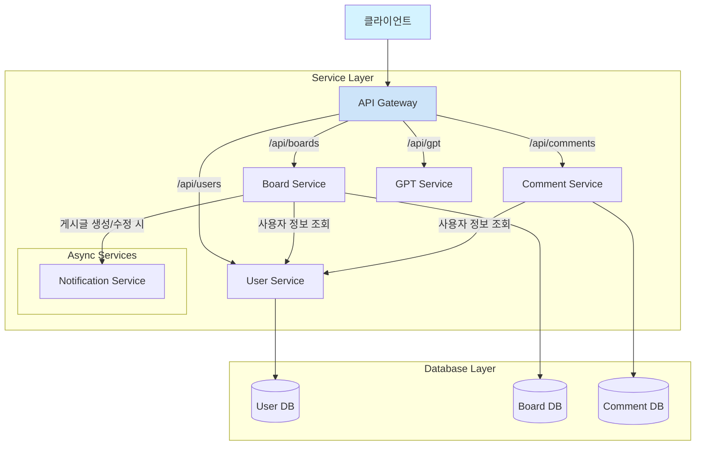

# Kingwangjjang 아키텍처

이 문서는 `kingwangjjang-be` 프로젝트의 전반적인 아키텍처, 서비스 간 상호작용, 데이터 흐름을 설명합니다.

## 시스템 개요

본 프로젝트는 마이크로서비스 아키텍처(MSA)를 따릅니다. 각 서비스는 독립적으로 개발, 배포 및 확장이 가능하며, 모든 외부 요청은 API 게이트웨이를 통해 라우팅됩니다.

## 서비스 간 호출 관계

서비스 간 통신은 주로 동기 방식의 REST API 또는 GraphQL 호출을 통해 이루어집니다. `docker-compose.yml` 기준으로 주요 서비스 의존성은 다음과 같습니다.

*   **API Gateway**: 모든 외부 요청의 진입점 역할을 하며, 요청을 적절한 내부 서비스로 라우팅하고 인증을 처리합니다.
*   **User Service**: 사용자 정보 및 인증을 담당하는 핵심 서비스. 다른 서비스들이 사용자 정보가 필요할 때 조회합니다.
*   **Board/Comment Service**: 게시판과 댓글 기능을 담당하며, 필요시 User Service에서 사용자 정보를 가져옵니다.
*   **GPT/Notification Service**: 특정 이벤트(예: 새 게시글)가 발생했을 때 다른 서비스에 의해 호출될 수 있는 보조 서비스입니다.

## 데이터 흐름

*   **데이터베이스 소유권**: 각 서비스는 자체 데이터베이스 또는 컬렉션을 소유하고 관리합니다. 다른 서비스는 API를 통해서만 해당 데이터에 접근할 수 있으며, 데이터베이스에 직접 접근하지 않습니다. (Database-per-service 패턴)
    *   `user-service`는 사용자 정보 DB를 소유합니다.
    *   `board-service`는 게시글 데이터 DB를 소유합니다.
*   **요청 흐름**:
    1.  클라이언트의 모든 요청은 **API Gateway**로 전송됩니다.
    2.  API Gateway는 요청 헤더의 JWT(JSON Web Token)를 사용하여 사용자를 인증합니다. (필요시 **User Service**에 토큰 유효성 검증 요청)
    3.  인증이 완료되면 API Gateway는 요청 경로에 따라 적절한 마이크로서비스(예: `board-service`)로 요청을 전달합니다.
    4.  해당 서비스는 비즈니스 로직을 처리하고 데이터베이스와 상호작용한 뒤, 결과를 다시 API Gateway를 통해 클라이언트에게 반환합니다.

## 인증 방식

*   **인증 주체**: `user-service`가 사용자 인증 및 JWT 발급을 담당합니다.
*   **인증 흐름**:
    1.  사용자가 ID/PW 또는 소셜 로그인을 통해 로그인을 요청합니다.
    2.  `user-service`는 사용자 정보를 확인하고 유효한 경우 JWT(Access Token/Refresh Token)를 생성하여 반환합니다.
    3.  클라이언트는 이후 모든 API 요청 시 `Authorization: Bearer <Access-Token>` 헤더에 토큰을 포함하여 전송합니다.
*   **서비스 간 인증**: 내부 서비스 간의 통신은 Docker 내부 네트워크에서 이루어지므로 현재는 별도의 추가 인증을 사용하지 않을 수 있으나, 보안 강화를 위해 API Key나 내부용 JWT를 사용할 수 있습니다. 현재 구조에서는 `api-gateway`가 인증을 중앙에서 처리합니다.
