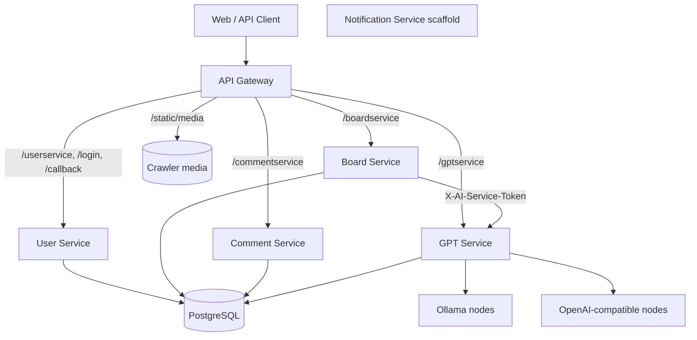

# 백엔드 아키텍처

이 문서는 2026-07-23 현재 `kingwangjjang-be`의 런타임 구성과 서비스 경계를 설명합니다.

## 런타임 구성

API Gateway는 유일한 공개 백엔드 진입점입니다. 로컬 소스 실행에서는 `33330`, Docker Compose에서는 호스트 `8000`을 사용합니다. `notification-service`는 코드 스캐폴드만 있으며 Compose, Gateway, 다른 서비스와 연결되어 있지 않습니다.

## 서비스 책임

| 서비스 | 소유하는 책임 | 포트 |
| --- | --- | ---: |
| `api-gateway` | 공개 경로, CORS, access token 검증, 관리자 역할 계산, 신뢰 헤더 전달, 응답·쿠키 프록시, 크롤러 미디어 | 로컬 33330 / Compose 8000 |
| `user-service` | Kakao OAuth, access/refresh token 발급과 회전, 사용자 프로필 | 33334 |
| `board-service` | 게시글/지표, 실시간·일간 목록, 일간 Top 10 스냅샷, 좋아요, AI 분석 상태, Shorts 패키지 | 33333 |
| `comment-service` | 댓글·답글, 수정·소프트 삭제, 댓글 좋아요 | 33335 |
| `gpt-service` | AI 노드·모델 레지스트리, capability 기반 라우팅, health/failover, 분석·채팅·vision 추론 | 33336 |
| `notification-service` | 향후 알림 전달 | 현재 미배포 |

## Gateway 라우팅

Gateway는 접두사를 제거한 뒤 내부 서비스로 전달합니다.

| 공개 경로 | 내부 대상 예시 |
| --- | --- |
| `/boardservice/api/boards/daily` | `board-service:33333/api/boards/daily` |
| `/userservice/api/users/me` | `user-service:33334/api/users/me` |
| `/commentservice/api/comments` | `comment-service:33335/api/comments` |
| `/gptservice/api/ai/nodes` | `gpt-service:33336/api/ai/nodes` |
| `/login`, `/callback` | `user-service:33334`의 같은 경로 |

프록시 timeout은 현재 90초입니다. Gateway는 redirect 상태와 `Location`, 여러 `Set-Cookie` 헤더를 보존합니다. `CRAWLER_MEDIA_ROOT`가 존재하면 `/static/media`로 읽기 전용 미디어를 제공합니다.

## 인증과 권한

1. 클라이언트가 Gateway의 `/login`으로 Kakao 로그인을 시작합니다.
2. `user-service`가 `/callback`에서 Kakao code를 교환하고 사용자와 브라우저별 refresh token 해시를 저장합니다.
3. 응답에는 HttpOnly `access_token`과 `refresh_token` 쿠키가 설정됩니다. 현재 access token은 1시간, refresh token은 400일입니다.
4. Gateway는 요청의 access token을 상태 없이 검증하고 사용자 ID·provider를 추출합니다.
5. 사용자 ID가 `ADMIN_USER_IDS`에 있으면 Gateway가 요청별 역할을 `admin`으로 계산합니다.
6. downstream 서비스는 Gateway가 설정한 헤더를 바탕으로 인증/인가합니다.
7. access token이 만료되면 `POST /userservice/api/auth/refresh`가 해당 브라우저의 refresh token 해시를 원자적으로 교체하고 두 토큰을 회전합니다. 성공할 때마다 만료 시점은 400일 뒤로 연장됩니다.

새 로그인은 `user_sessions`에 독립된 행을 추가하므로 같은 Kakao 계정의 다른 기기 세션을 종료하지 않습니다. 이전 버전이 `users.refresh_token`에 저장한 평문 토큰은 첫 refresh 요청에서 같은 트랜잭션으로 해시 세션에 이관되고 평문 값은 제거됩니다.

신뢰 헤더는 `X-User-Id`, `X-Auth-Provider`, `X-User-Role`, `X-Auth-Status`, `X-Auth-Error`입니다. Gateway는 클라이언트가 보낸 같은 이름의 헤더를 먼저 제거하므로, 외부 클라이언트는 서비스 포트에 직접 접근해서는 안 됩니다.

## 데이터 소유권

현재 모든 영속 서비스는 같은 `DATABASE_URL`을 받아 하나의 PostgreSQL 인스턴스/데이터베이스에 연결합니다. 물리적으로 DB를 분리한 구성은 아니지만, 테이블 소유권은 서비스 단위로 유지합니다.

| 소유 서비스 | 테이블 |
| --- | --- |
| `user-service` | `users`, `user_sessions` |
| `board-service` | `boards`, `board_metric_snapshots`, `daily_top10_snapshots`, `board_likes` |
| `comment-service` | `comments`, `comment_likes` |
| `gpt-service` | `ai_nodes`, `ai_node_models` |

서비스는 다른 서비스의 repository나 DB 모듈을 import하지 않습니다. 교차 도메인 정보가 필요하면 Gateway 신뢰 헤더, 서비스 API, 이벤트 또는 명시적으로 소유권을 정한 읽기 모델을 사용합니다. Gateway는 DB에 접근하지 않습니다.

## 게시글 분석 흐름

크롤러가 저장한 새 게시글은 `pending` 분석 상태로 들어옵니다. `board-service`의 lifespan에서 시작되는 worker가 대기열을 가져가며, 기본 동시성은 1이고 `ANALYSIS_WORKER_CONCURRENCY`로 1~16 범위에서 조정합니다. 기본값 1은 단일 동시 추론만 받는 기본 AI 노드에서 일시적인 503이 게시글 재시도 횟수를 소모하지 않도록 맞춘 값입니다.

`board-service`는 `gpt-service`의 `POST /api/ai/analyze`를 호출하고 결과 요약·태그·참여도 점수와 이유를 자신의 게시글 데이터에 저장합니다. 인증 사용자는 게시글별 재분석을 비동기 job으로 요청하고 상태를 조회할 수도 있습니다. AI 모델 호출은 `gpt-service`만 담당합니다.

## AI 노드 라우팅

`gpt-service`는 노드별 provider, base URL, priority, weight, 동시성, timeout, 상태와 모델 capability를 PostgreSQL에 저장합니다. 추론 요청은 `analysis`, `chat`, `vision` capability에 맞는 노드를 고르고 실패 시 다른 후보로 failover합니다.

- 관리 API: `X-AI-Admin-Token`
- 내부 추론 API: `X-AI-Service-Token`
- 실제 upstream API key: DB가 아니라 노드의 `api_key_env`가 가리키는 프로세스 환경변수

노드 테이블이 비어 있을 때만 `OLLAMA_*`, `VLLM_*` 환경변수로 초기 노드를 bootstrap합니다. 이후 변경은 관리 API로 DB에 영속화합니다.

## 현재 제약

- 서비스별 테이블 소유권은 논리적 경계이며 PostgreSQL 데이터베이스 자체는 공유합니다.
- AI 노드의 동시성 semaphore와 weight cursor는 단일 `gpt-service` 프로세스 기준입니다. 여러 worker/replica로 늘리려면 공유 상태가 필요합니다.
- 수동 게시글 재분석 job 상태는 `board-service` 프로세스 메모리에 있으므로 재시작 시 사라집니다. 저장된 게시글 분석 결과는 PostgreSQL에 남습니다.
- 알림 서비스는 실제 호출·이벤트·영속화가 구현되지 않았습니다.
